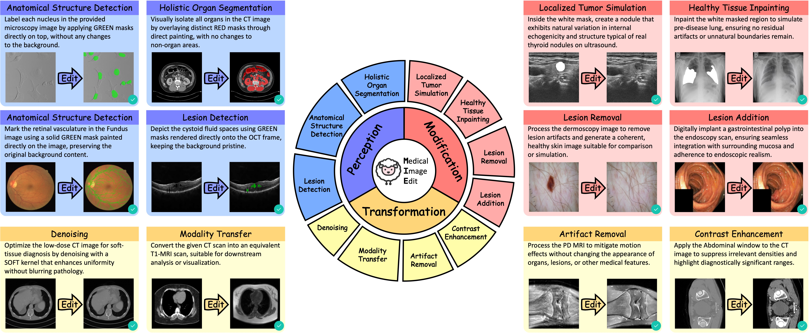

<div align="center">
<h1>MieDB-100k: A Comprehensive Dataset for Medical Image Editing</h1>

<a href='https://arxiv.org/abs/2602.09587'></a>
<a href='https://huggingface.co/datasets/Laiyf/MieDB-100k'></a>

<p align="center"></p>
</div>

## 📄 Introduction

MieDB-100k is a large-scale, high-quality and diverse dataset for text-guided medical image editing. It is constructed via both modality-specific expert models and rule-based data synthetic methods, followed by rigorous manual inspection to ensure clinical fidelity.

This repository contains:
- MieDB-100k dataset
- Scripts for running and evaluating editing models
- Scripts for finetuning OmniGen2 on MieDB-100k

## ⚙️ Dataset Setup

### Dataset Download

1. Download compressed MieDB-100k dataset from our [huggingface repo](https://huggingface.co/datasets/Laiyf/MieDB-100k):

```bash
# For benchmark split
python dataset_download.py 

# For train split
python dataset_download.py --train
```

2. Extract compressed file via:

Benchmark split:
```bash
mkdir dataBenchmark
pv dataBenchmark_*.tar | tar -xf - -C dataBenchmark --skip-old-files
```

Train split:
```bash
mkdir dataTrain
pv dataTrain_*.tar | tar -xf - -C dataTrain --skip-old-files
```

Note:
- `pv` is used for progress visualization. You can switch to `cat` if you want to extract in silence manner.
- macOS doesn't support --skip-old-files, use `tar -xkf - -C /path/to/dst/` instead after the pipe.

### Environment Setup

Create new conda enviroment via:
```bash
conda create -n miedb python=3.11 -y
conda activate miedb
```

Then, install python dependencies:
```bash
pip install -r requirements.txt
```

### Repository Structure

The structure of this repository should be like:
```
./
├── assets/
│   ├── ...
├── dataBenchmark/
│   ├── metadata.json
│   ├── input
│   └── output
├── dataTrain/
│   ├── metadata.json
│   ├── input
│   └── output
├── evaluation/
│   ├── ...
├── inference/
│   ├── ...
├── OmniGen2-MIE/
│   ├── ...
├── README.md
├── dataset_download.py
├── pyrightconfig.json
├── requirements.txt
└── ...
```

## 🧪 Benchmark Inference

We provide the inference scripts for all baseline models evaluated in our paper.
Note that for proprietary models, the internal API endpoints used during our experiments have been replaced with placeholders.
To run evaluations for these closed-source models, you must configure the scripts with your own API credentials and provider endpoints.

To train and evaluate OmniGen2-MIE, please refer to [this instruction](OmniGen2-MIE/README.md).

## 🚀 Benchmark Evaluation

1. Switch into `evaluation` directory:
```bash
cd evaluation
```

2. To evaluate DICE and Perception Accuracy, run:
```bash
python DICE.py
```
Note that you can change the evaluation subject by modify the `MODEL_NAME` variable according to their resulted folder name under `inference/eval_results`. This holds for other evaluation scripts.

3. To evaluate Background PSNR and SSIM in Perception perspecitve, run:
```bash
python PSNR-SSIM-perception.py
```

4. To evaluate in Modification perspective, run:
```bash
python Mod_collager.py # Create collage image serving as VLM input
python VLM_evaluate.py
```

5. To evaluate in Transformation perspecitve, run:
```bash
python PSNR-SSIM-transformation.py
```

## 🐑 Citation

```
@article{miedb100k,
      title={MieDB-100k: A Comprehensive Dataset for Medical Image Editing}, 
      author={Yongfan Lai and Wen Qian and Bo Liu and Hongyan Li and Hao Luo and Fan Wang and Bohan Zhuang and Shenda Hong},
      year={2026},
      journel={Preprint at Arxiv}
      url={https://arxiv.org/abs/2602.09587}, 
}
```

If you find our work helpful, please give us a star🌟